# Employee Portal - Responsive Web Application

A modern, responsive employee management portal built with PHP, MySQL, Bootstrap, and Chart.js. This application provides comprehensive employee management features including attendance tracking, birthday/anniversary notifications, and interactive data visualization.

## 🚀 Features

### 📊 Dashboard

- **Real-time Statistics**: Today's attendance count, weekly working hours, team metrics
- **Interactive Charts**:
  - Today's Attendance Distribution (Donut Chart)
  - Weekly Attendance Trend (Stacked Bar Chart)
- **Recent Activities**: Latest employee activities and updates
- **Upcoming Events**: Birthday and anniversary notifications


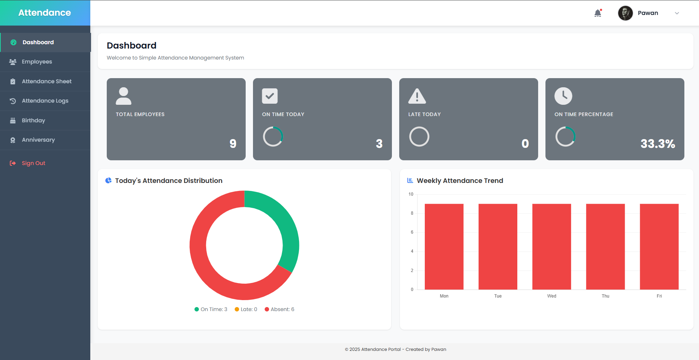
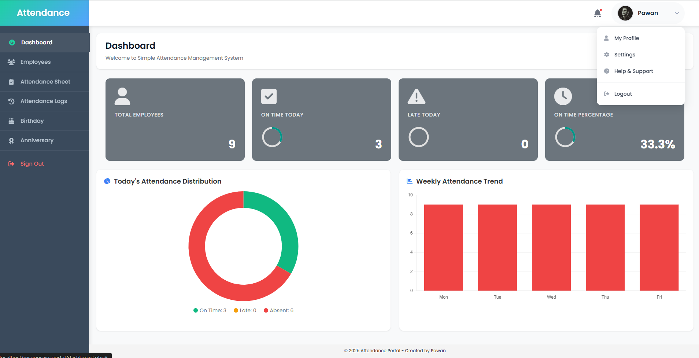

### 👥 Employee Management

- **Employee Directory**: Complete employee information management
- **Add/Edit/Delete**: Full CRUD operations for employee data
- **Profile Management**: Individual employee profiles with photos
- **Role-based Access**: Different permission levels for users


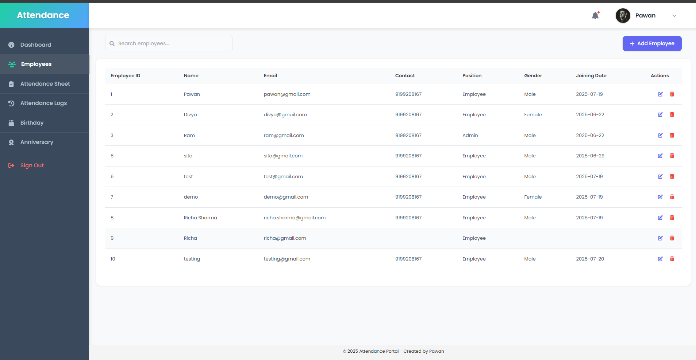

### ⏰ Attendance System

- **Attendance Sheet**: Daily attendance tracking and management
- **Attendance Logs**: Historical attendance data with filtering
- **Time Tracking**: Check-in/check-out functionality
- **Custom Logic**: On-time (before 9:30 AM) vs Late arrival tracking
- **Weekend Exclusion**: Business days only for accurate reporting


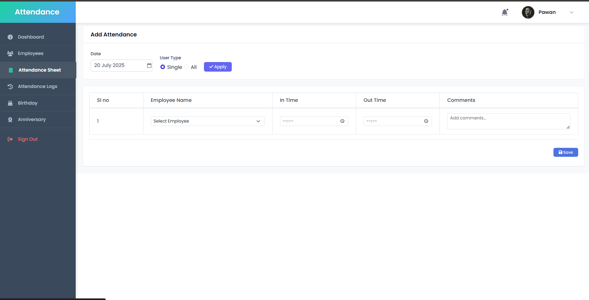
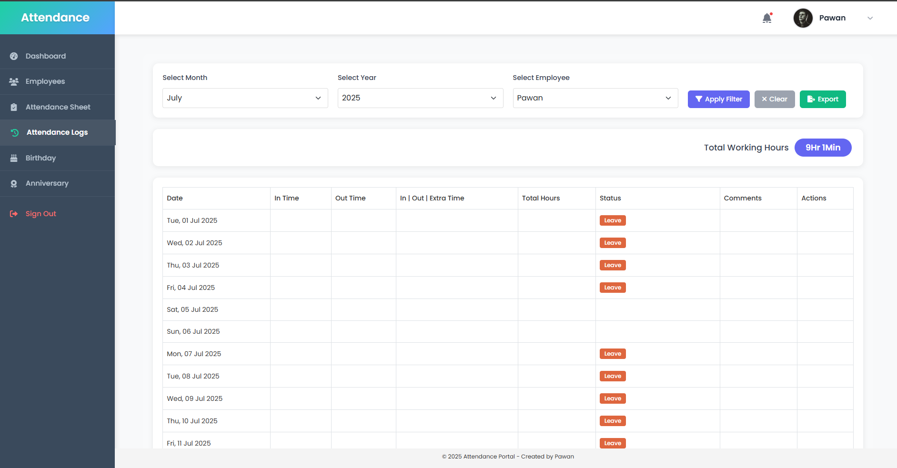

### 🎉 Employee Celebrations

- **Birthday Notifications**: Automated birthday reminders and celebrations
- **Work Anniversaries**: Track and celebrate work milestones
- **Monthly Filtering**: View celebrations by specific months
- **Today's Celebrations**: Highlight current day events


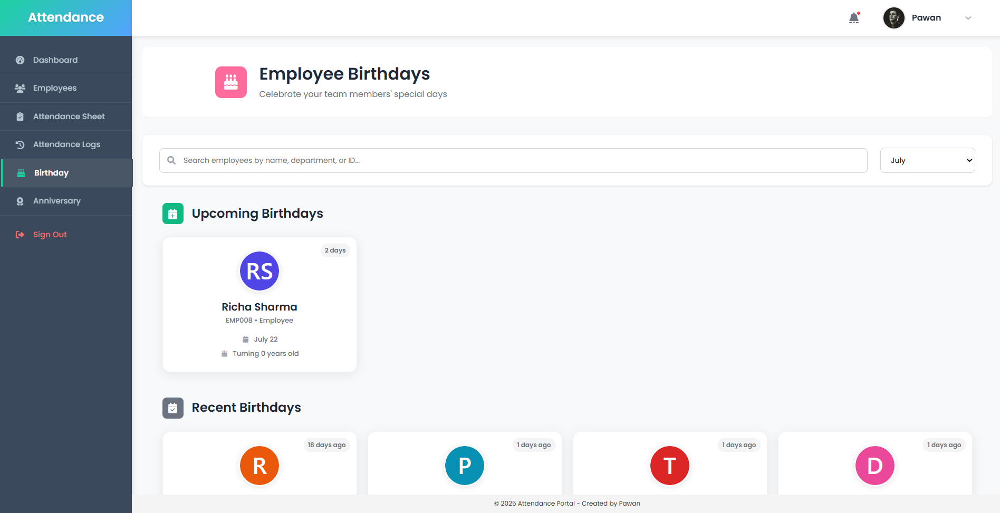
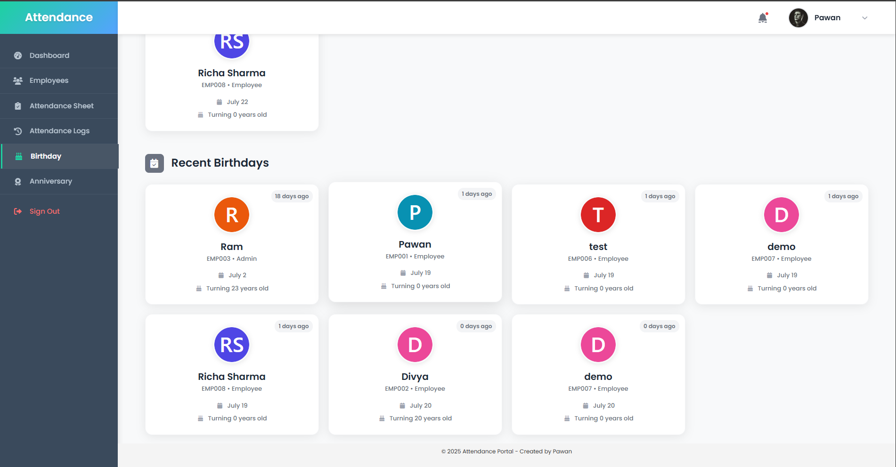
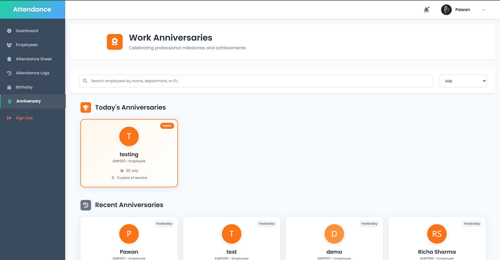

### 📱 Responsive Design

- **Mobile-First**: Optimized for all device sizes
- **Modern UI**: Clean, professional interface
- **Bootstrap 5**: Latest responsive framework
- **Cross-browser**: Compatible with all modern browsers


## 🛠️ Technology Stack

### Frontend

- **HTML5/CSS3**: Modern semantic markup and styling
- **Bootstrap 5.3.2**: Responsive UI framework
- **JavaScript/jQuery**: Interactive functionality
- **Chart.js 4.x**: Data visualization library
- **FontAwesome**: Icon library

### Backend

- **PHP 7.4+**: Server-side programming
- **MySQL**: Database management
- **Session Management**: Secure user authentication

### Tools & Libraries

- **XAMPP**: Local development environment
- **Chart.js**: Interactive charts and graphs
- **Pravatar**: Random profile picture generation

## 📋 Prerequisites

Before running this application, make sure you have:

- **XAMPP** (or LAMP/WAMP) installed
- **PHP 7.4** or higher
- **MySQL 5.7** or higher
- **Web browser** (Chrome, Firefox, Safari, Edge)

## ⚙️ Installation

1. **Clone the repository**

   ```bash
   git clone https://github.com/ucontactpawan/Employee-responsive-portal.git
   ```

2. **Move to XAMPP directory**

   ```bash
   # Copy the project to your XAMPP htdocs folder
   cp -r employee-responsive-portal /xampp/htdocs/responsive-portal
   ```

3. **Start XAMPP services**

   - Start Apache
   - Start MySQL

4. **Import database**

   - Open phpMyAdmin (http://localhost/phpmyadmin)
   - Create a new database named `employee_portal`
   - Import the `employee_portal.sql` file

5. **Configure database connection**

   ```php
   // Update includes/db.php with your database credentials
   $servername = "localhost";
   $username = "root";
   $password = "";
   $dbname = "employee_portal";
   ```

6. **Access the application**
   ```
   http://localhost/responsive-portal
   ```

## 🗂️ Project Structure

```
responsive-portal/
├── css/                    # Stylesheets
│   ├── style.css          # Main styles
│   ├── navbar.css         # Navigation styles
│   ├── dashboard.css      # Dashboard specific styles
│   ├── employee.css       # Employee page styles
│   ├── attendance_*.css   # Attendance related styles
│   └── birthday.css       # Birthday/Anniversary styles
├── js/                    # JavaScript files
│   ├── dashboard.js       # Dashboard functionality
│   ├── employee_new.js    # Employee management
│   ├── attendance_*.js    # Attendance scripts
│   └── notifications.js   # Notification system
├── includes/              # PHP includes
│   ├── db.php            # Database connection
│   ├── auth.php          # Authentication
│   ├── navbar.php        # Navigation component
│   ├── sidebar.php       # Sidebar component
│   └── *_functions.php   # Various utility functions
├── images/               # Static images
├── screenshots/          # Application screenshots
├── *.php                # Main application pages
└── employee_portal.sql  # Database schema
```

## 📸 Screenshots

### Desktop View


### Mobile Responsive

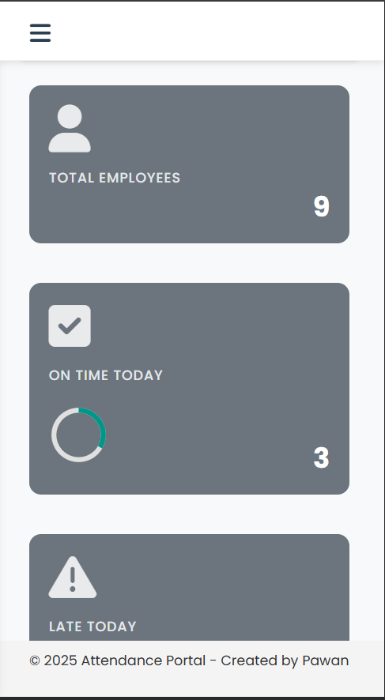
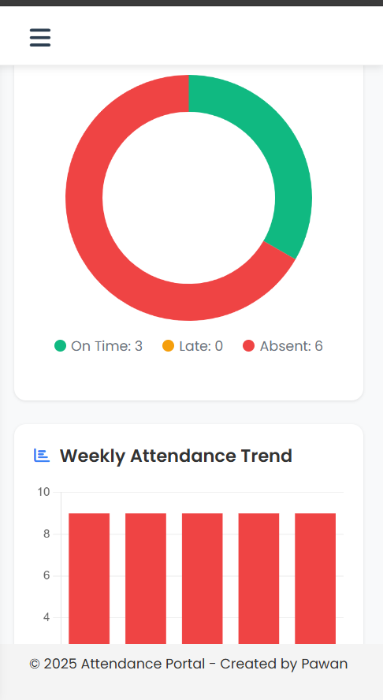
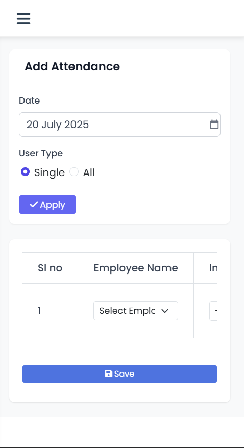
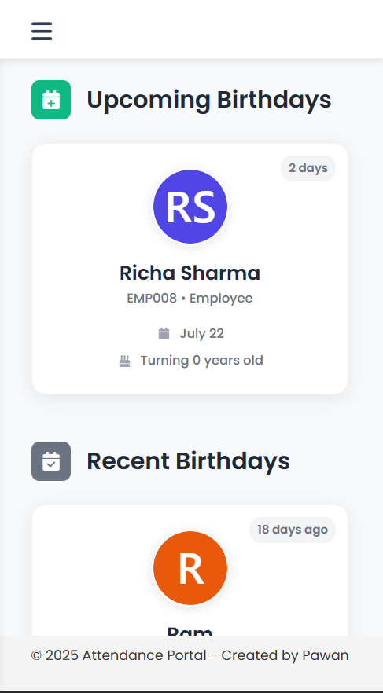
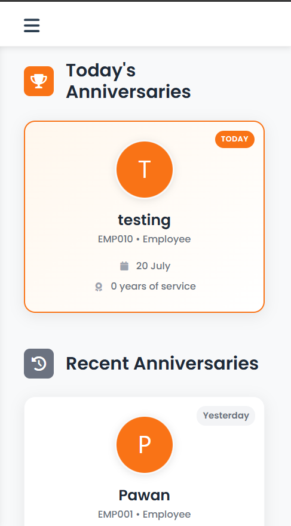

### Dashboard Analytics

- **Today's Attendance**: Real-time count of present employees
- **On-time vs Late**: Visual representation of punctuality
- **Weekly Trends**: 7-day attendance patterns
- **Team Metrics**: Department-wise statistics

### Smart Attendance Logic

```php
// Custom attendance logic
if (check_in_time <= '09:30:00') {
    $status = 'On Time';
} else {
    $status = 'Late';
}
```

### Responsive Navigation

- **Desktop**: Full navigation with user profile
- **Mobile**: Collapsible hamburger menu
- **User Avatar**: Random profile pictures with initials fallback
- **Notification System**: Bell icon with badge indicators

## 🔧 Configuration

### Database Setup

1. Import the provided SQL file
2. Update database credentials in `includes/db.php`
3. Ensure proper table relationships are maintained

### Customization

- **Colors**: Modify CSS variables in `css/style.css`
- **Charts**: Configure Chart.js options in `js/dashboard.js`
- **Attendance Logic**: Adjust time thresholds in `includes/get_dashboard_data.php`

## 🤝 Contributing

1. Fork the repository
2. Create a feature branch (`git checkout -b feature/AmazingFeature`)
3. Commit your changes (`git commit -m 'Add some AmazingFeature'`)
4. Push to the branch (`git push origin feature/AmazingFeature`)
5. Open a Pull Request

## 👨‍💻 Author

- GitHub: (https://github.com/ucontactpawan)
- Email: ucontactpawan@gmail.com

## 🙏 Acknowledgments

- Bootstrap team for the amazing framework
- Chart.js community for data visualization
- FontAwesome for beautiful icons
- Pravatar for profile picture service

## 📞 Support

If you have any questions or need support, please:

1. (https://github.com/ucontactpawan/employee-responsive-portal/issues) section
2. Create a new issue if your problem isn't already reported
3. Contact the maintainer directly

---

⭐ **If you found this project helpful, please give it a star!** ⭐
